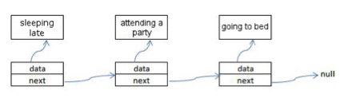

# Exercise 04 -- Abstract Data Types
### Submission Deadline: December 9, 2018 at 3 pm

In the fourth assignment, the tasks focus on two topics: **Object-Oriented Design** and **Abstract Data Types**.

For solving the tasks, this repository contains:

* a `src` Folder, containing *six* java files, providing the source code templates for your the particular tasks. These files serve as a starting point for your solution.
**IMPORTANT: Make use of the provided class for your solution. Also, do not change the method signature on your own (there is a good reason for the provided signatures). Otherwise, we will account for a malus (i.e., reducing your points even if the solution is basically correct)!**
* a `test` folder, containing the tests for the implementation. These tests are implemented by the instructor and can be used by you to improve your code. Also, these tests are kind of initial sanity check for assessing the assignment.
**Run the tests to check whether your solutions work correctly. But do not touch/change them!**
* some more files needed for handling the project in Eclipse (or for proper push/pull the repository). See the slides for more details. In general, the other files **should not be changed or deleted, if you do not really know what you are doing**!!

In the following, you will find the particular tasks to be solved.

## Task 4-01: Abstract Class

We wish to build new cars, motorcycles and buses. These should be able to open and lock their doors (if any) and to activate the windscreen wiper. In addition, cars and buses should be able to automatically open their trunk, whereas this is done manually for motorcycles. Steering is not important at this stage of development.

<table border="0">
  <tr>
   <td>
     
   Please write an abstract class `Vehicle` containing the following *private* member variables:
   ```
  private boolean wiper_active; 
  private boolean[] doors; 
  private boolean trunk_open;
   ```
  
  The variables should store whether the *wiper is active*, for *each door whether it is locked* 
  (i.e., `doors[i]==true`) and for the *trunk whether it is open*.
   </td>

<td>1 Point</td>
  </tr>
<tr>
  <td>
  
  Next, add the following methods and **implement non-abstract methods** in an appropriate way:
  ```
	public void toggle_wiper() {…}

	public boolean getWiperState() {…} 
	public int getNumberOfDoors() {…}
	public boolean getDoorState(int door) {…} 
	public boolean getTrunkState() {…} 

	public abstract void unlockAllDoors(); 
	public abstract void lockAllDoors(); 
  
  ```
  Finally, implement the following constructor:
  
  ```
  public Vehicle(boolean wiperState, boolean trunkState) {…} 
  ```
  
  The constructor should initialize the member variables `wiper_active` and `trunk_open`. 
  However, do **not** initialize the `doors` variable as this is dependent on the concrete number of doors.
  </td>
  <td>2 Points
  </td>
</tr>
<tr>
  <td>
  
  Next, write the classes `Car`, `Motorcycle`, and `Bus` extending the abstract class fro above. 
  Write a new constructor with the same parameters as above which additionally initializes the 
  member variable `doors` with the appropriate number of doors. 
  Remember to call the constructor of the abstract class `Vehicle` by using `super()`. 

  Moreover, you should implement the functions:
  
  ```
  public void unlockAllDoors() {…} 
  public void lockAllDoors() {…}
  
  ```

</td>
  <td>2 Points</td>
</tr>
<tr>
  <td>
  
  Finally, *cars* and *buses* are usually able to automatically open their trunk. 
  To this end, write a small `interface Trunk` containing the following functions, 
  which should be implemented by the classes `Car` and `Bus`:
  ```
  public void openTrunk(); 
  public void closeTrunk();
  
  ```
  </td>
  <td>1 Point</td>
</tr>
</table>


## Task 4-02: LinkedList

In this task, you should implement a class `LinkedNode` that works as depicted in the example below 
(which shows three instances of class node that are chained together).



In particular, it should be possible that nodes can be chained to form a data structure that is similar to a `LinkedList`.
To this end, each node contains the following attributes to keep track of its data item as well as of the next node.

```
public class LinkedNode<E> {
    E data_;
    LinkedNode<E> next_;
    …
}

```

<table border="0">
<tr>
  <td>
  
  Write appropriate *constructors* as well as *getter* and *setter* methods
  
  </td>
  <td>2 Points</td>
</tr>
<tr>
  <td>
  
Please write a method
```
public String toText ()
```
printing all node content starting at `this` (i.e., the node calling the method) and 
proceeding until the end (null) of the linked node chain is reached.
Within the String, the particular *data items should be separated by a Comma*.

</td>
  <td>2 Point</td>
</tr>
<tr>
  <td>
  
Within the `main` function, please create the linked nodes as depicted in the picture above. 
Check your list by using your `toText()` function.
Now use the `main` function to insert the nodes *“visit the canteen”*, *“attend a lecture”*, 
and *3 other nodes* of your choice into the node structure created previously. 
Print this list as well.
  
  </td>
  <td>1 Point</td>
</tr>
<tr>
  <td>
  
You may not be comfortable with this daily routine. 
Hence, use the created ADT in the following way: the nodes *Monday*, *Thursday* and *Friday* are 
the initial nodes that are created and chained together. 
Then, you should *add* the nodes *Tuesday* and *Wednesday* subsequently 
*in correct calendrical order*. Again, print the result using your `toText()` function.  
  </td>
  <td>1 Point</td>
</tr>
</table>

## Task 4-03: Using Stacks: Palindromes

A string is called a palindrome if it is written the same way when reading it from front to back 
as well as from back to front. Examples for palindromes are the following:

||	||
|---|---|---|
|Hannah |	| Madam, I’m Adam|
|Rotator  |	|Dammit, I’m mad!
Rats live on no evil star. ||Was it a car or a cat I saw?
A man, a plan, a canal: Panama. ||No lemon, no melon.


<table border="0">
<tr>
  <td>
  
Please write a function:
```
public static boolean isPalindrome (String str)
```
in class `Main` for checking whether the given string may be called palindrome or not. 
*Spaces, special characters and punctuation characters* should be ignored (find out yourselves how to do this on strings). 
Moreover, *lower-case* and *upper-case* letters should be treated *equally*.
**Do NOT use the predefined function `reverse` within your solution.** 
Use the class `java.util.Stack<T>` instead. 

Test your implementation in the `main` method by using the examples given above.
  
  </td>
  <td>4 Points</td>
</tr>
<tr>
  <td align="right">Total Points</td>
    <td>16</td>
</tr>
</table>
