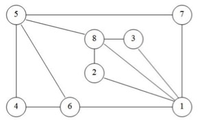

# Exercise 07 -- Graphs
### Submission Deadline: January 13, 2019 at 3 pm

In the seventh assignment, the topic are **Graphs** (will be introduced in the Lecture on January 8, 2019).

For solving the tasks, this repository contains:

* a `src` Folder, containing *two* java files, providing the source code templates for your the particular tasks. These files serve as a starting point for your solution.
**IMPORTANT: Make use of the provided class for your solution. Also, do not change the method signature on your own (there is a good reason for the provided signatures). Otherwise, we will account for a malus (i.e., reducing your points even if the solution is basically correct)!**
Moreover, a .txt file is contained that must be used to answer the theoretical questions.
* a `test` folder, containing the tests for the implementation. These tests are implemented by the instructor and can be used by you to improve your code. Also, these tests are kind of initial sanity check for assessing the assignment.
*Remember that you can run the test file(s) as well to check whether your implementation works correctly.*    
**Run the tests to check whether your solutions work correctly. But do not touch/change them!**
* some more files needed for handling the project in Eclipse (or for proper push/pull the repository). See the slides for more details. In general, the other files **should not be changed or deleted, if you do not really know what you are doing**!!

In the following, you will find the particular tasks to be solved.

## Task 7-01: Graphs Representation

<table border="0">
  <tr>
   <td>
Please visualize the following (unweighted) graphs: 

```
undirected graph A
  V = {1,2,3,4,5}, 
  E = {{1,2},{1,3},{1,4},{1,5},{2,4},{2,5},{3,4},{4,5}}

directed graph B
  V = {1,2,3,4,5,6}, 
  E = {{1,1},{1,2},{1,4},(2,3),{2,4},{2,5},{3,6},{4,1},{5,6},{6,4}}
```

**Note:You have to submit your answer electronically (i.e., by adding it to the repository). However, it is up to you how to do this: using the .txt file (and ASCII symbols to indicate the graphs), creating the graph with pen&paper and scan it, or use some simple drawing tool and upload the solution as picture.**

</td>

<td> 2 Points</td>
  </tr>
<tr>
  <td>
  
Please use the file `TheoreticalQuestions.txt` to represent the graphs A and B as: 

```
                    edge list: int[] edgelist

                    node list: int[] neighborhood
                               int[] nodeNhd

             adjacency matrix: int[][] edge

adjacency list representation: [A]->[B][ ]->[C][ ]
                               [B]->[B][ ]
                               ...                            
```

</td>
  <td>4 Points</td>
</tr>
</table>

## Task 7-02: Adjacency Matrix

In the following, we will consider an adjacency matrix: `int [ ] [ ] edge`. Indexing will start at zero. The vertex names are given by its index, respectively. The following methods should be implemented. 

<table border="0">
<tr>
  <td>
  
Please implement a method to *get the number of edges leading to a vertex of a directed, unweighted graph*:
```
public int inDegree (int vertex, int[][] edge)
```

</td>
  <td>2 Points</td>
</tr>
<tr>
  <td>
  
  Please implement a method to *get the number of edges leading away from a vertex of a directed, unweighted graph*:
  ```
  public int outDegree (int vertex, int[][] edge)
  ```
  
  </td>
  <td>2 Points</td>
</tr>
<tr>
  <td>
  
  Please implement a method to *get a list of all adjacent vertices that are directly reachable from a vertex of a directed, unweighted graph*:
  ```
  public List<Integer> adjacent (int vertex, int[][] edge)
  ```
  
  </td>
  <td>2 Points</td>
</tr>
<tr>
  <td>

Within the main method, please test your methods from above for the following directed, unweighted graph:
```
directed graph B
  V = {1,2,3,4,5,6}, 
  E = {{1,1},{1,2},{1,4},{2,3},{2,4},{2,5},{3,6},{4,1},{5,6},{6,4}}
```

</td>
  <td>1 Point</td>
</tr>
</table>

## Task 7-03: Breadth-First and Depth-First Search
Please consider the following undirected graph:



<table border="0">
<tr>
  <td>
  
Please use the *Breadth-First Search* with a start vertex *8*. Write down the order in which the vertices are visited. If several vertices may be visited next, choose the one with the smallest value. *Note: Write your answer in the `TheoreticalQuestions.txt` file.* 

</td>
  <td>1 Point</td>
</tr>
<tr>
  <td>
  
Please use the *Depth-First Search* with a start vertex *8*. Write down the order in which the vertices are visited. If several vertices may be visited next, choose the one with the smallest value. *Note: Write your answer in the `TheoreticalQuestions.txt` file.* 

</td>
  <td>1 Point</td>
</tr>
<tr>
  <td align="right">Total Points</td>
    <td>15</td>
</tr>
</table>
