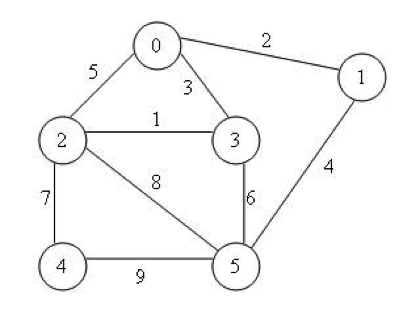
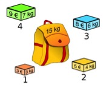

# Exercise 08 -- Graph Algorithms
### Submission Deadline: January 20, 2019 at 3 pm
In the eigth assignment, the topic are **Graph Algorithms** (as introduced in the Lecture on January 15, 2019).

For solving the tasks, this repository contains:

* a `src` Folder, containing *one* text file, in which you should write down your solutions for the particular tasks.
* Any of the other folders are irrelevant this time, as no programming tasks need to be accomplished!

In the following, you will find the particular tasks to be solved.

## Task 8-01: Topological Sorting

This night I would like to go to a party. However, I need to do some things prior: 

```
Task 01: doing my math homework
Task 02: doing the dishes
Task 03: select some MP3s as party music
Task 04: fetch that math book from the library
Task 05: driving into the city
Task 06: preparing ICSE exercises
Task 07: pick up a friend from the train station    
Task 08: clean my shoes
Task 09: search for some music
Task 10: set up my computer
Task 11: take out the trash
Task 12: connect my computer to the network
Task 13: buy some dish soap
Task 14: print ICSE exercise sheet
Task 15: buy some coke
Task 16: returning from the city
```

<table border="0">
  <tr>
   <td>
   
Please illustrate the dependencies of the tasks above in a *directed acyclic graph (DAG)*. There should be **at least 20 edges**. 
You can use the task numbers as label for the nodes (e.g., node with label '5' corresponds to task 05).    
*Hint: starting with node 4 may be a good idea.*    
**Note:You do need to submit your answer electronically. However, it is up to you how to do this: using the .txt file (and ASCII symbols to indicate the graphs), creating the graph with pen&paper and scan it, or use some simple drawing tool and upload the solution as picture.**    
   
   </td>

<td> 2 Points</td>
  </tr>
<tr>
  <td>

Please use the *two* Topological Sort Algorithms (*Backward and Forward*) to calculate a topologically sorted order of the graph. Make clear the starting node you have used.  
You can note down the result in the provided text file. 
  
  </td>
  <td>2 Points</td>
</tr>
</table>

## Task 8-02: Lowest Cost & Shortest Path Problem

Please consider the following undirected graph:



<table border="0">
  <tr>
   <td>
   
Please use the *Dijkstra’s Algorithm* with a **start vertex 0** to write down the order in which the vertices are visited.  
Submit your answer by using the provided text file.

</td>

<td>2 Points</td>
  </tr>
<tr>
  <td>
  
  Please use the *Prim-Jarnik Algorithm* with a **start vertex 0** to write down the order in which the vertices are visited.  
  Submit your answer by using the provided text file.
  
  </td>
  <td>2 Points</td>
</tr>
<tr>
  <td>...</td>
  <td>...</td>
</tr>
</table>

## Task 8-03: Knapsack Problem

Assume you are given **four** objects, and you should fit *as many of them* into a knapsack of **size 15** as possible. The *resulting value* of the objects should be *as large as possible*.



<table border="0">
  <tr>
   <td>
   
Please select your objects using the **Greedy principle** according to some greedy criterion you may choose yourself (*please make clear which criterion you’ve been used*). Is this solution optimal?   Submit your answer by using the provided text file.   
   
   </td>

<td>2 Points</td>
  </tr>
<tr>
  <td>
  
  Please explain and apply the principle of **dynamic programming** using the example above.  
  Submit your answer by using the provided text file.
  
  </td>
  <td>2 Points</td>
</tr>
<tr>
  <td align="right">Total Points</td>
    <td>12</td>
</tr>
</table>

Good Luck!
